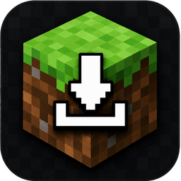
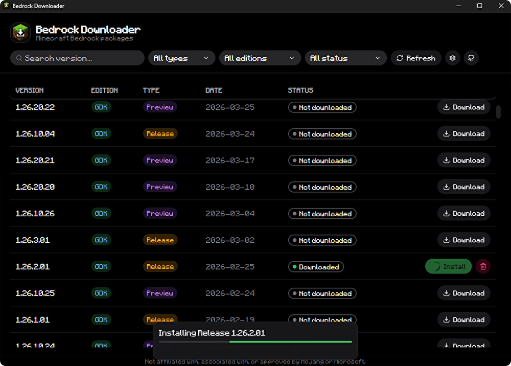

<div align="center">



# BedrockDownloader

Download Minecraft Bedrock versions (UWP &amp; GDK) from Microsoft's CDN.




</div>

---

A Windows desktop app (Tauri + React) for downloading Minecraft Bedrock packages.
UWP (`.appx`) versions can be installed and launched; GDK (`.msixvc`) versions are
download-only. No Microsoft account is needed to download.

## Features

- GDK (`.msixvc`) and UWP (`.appx`), release and preview
- UWP: download, install, launch - GDK: download
- Resumable, MD5-verified downloads
- Per-version context menu; configurable download folder

## Install

Get the installer from the [releases](https://github.com/Riyoway/BedrockDownloader/releases),
or build it yourself:

```bash
git clone https://github.com/Riyoway/BedrockDownloader
cd BedrockDownloader
npm install
npm run tauri:dev     # run
cargo tauri build     # build an NSIS installer
```

Requires Rust, Node.js, and the Tauri CLI (`cargo install tauri-cli --version "^2"`).

## Usage

1. Pick a version and download it.
2. UWP: Install, then Launch. GDK is download-only.
3. Right-click a row for more actions; change the location in Settings.

Files live under `%APPDATA%\BedrockDownloader` (configurable): `installers/` for
downloads, `versions/` for extracted UWP installs.

## How it works

- GDK versions are listed by [`minecraft-windows-gdk-version-db`](https://github.com/LiteLDev/minecraft-windows-gdk-version-db)
  (direct `xboxlive.com` URLs + MD5). The `.msixvc` is encrypted, so it is download-only.
- UWP versions are listed by raythnetwork (Windows Update IDs). The `.appx` link
  is resolved from Microsoft's FE3 service and unzipped.

See [docs/MECHANISM.md](docs/MECHANISM.md) for details.

## Credits

- [LiteLDev/minecraft-windows-gdk-version-db](https://github.com/LiteLDev/minecraft-windows-gdk-version-db) - GDK version list
- [raythnetwork](https://www.raythnetwork.co.uk) - UWP version list

## License

MIT - see [LICENSE](LICENSE). Dependencies: [THIRD-PARTY-NOTICES.md](THIRD-PARTY-NOTICES.md).

---

Not affiliated with or endorsed by Mojang or Microsoft.
